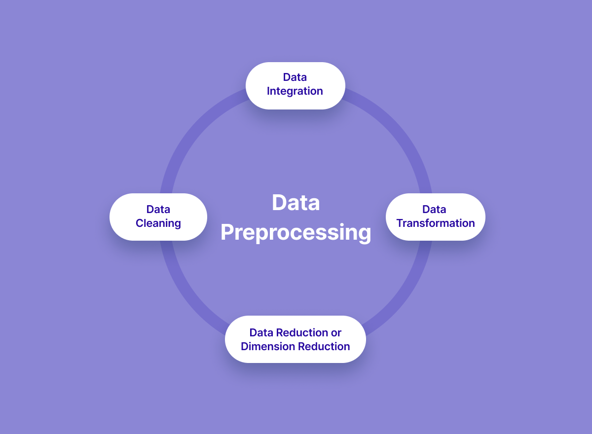

# autoDATA-prep
autoDATA-prep automates the data pre-processing step, this accelerates the first stage of any Data Analysis/ Data Science/ML pipeline.

- Removing Missing Values.
- Converting Categorical Variables to Quantitative Variables.
- Normalizing Data as an Option.
- Applying Standardization Techniques to Image Data for Computer Vision.
- Applications ; General Data Science Projects, ML, Computer Vision, Natural Language Understanding ;  Processing and Generation (NLP & NLG), Signal Processing 

